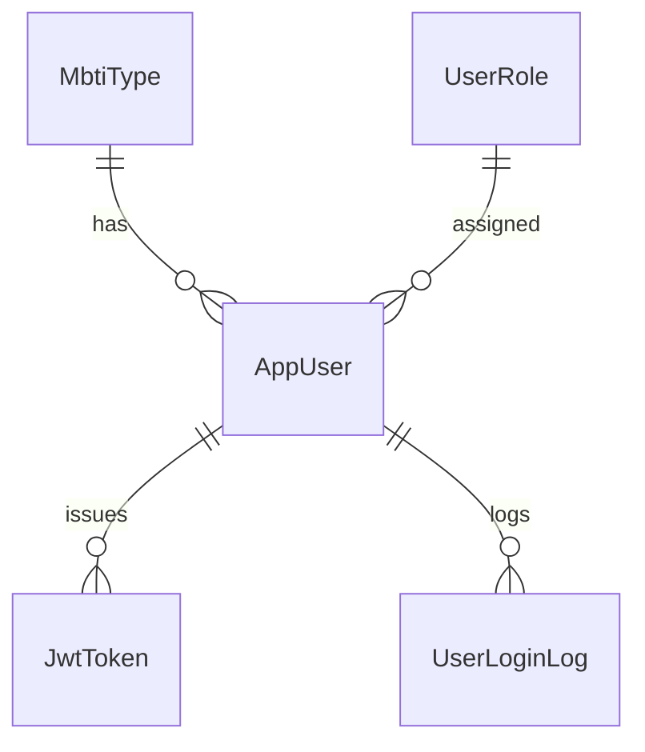
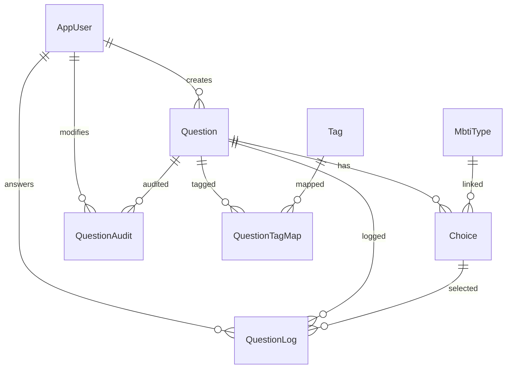
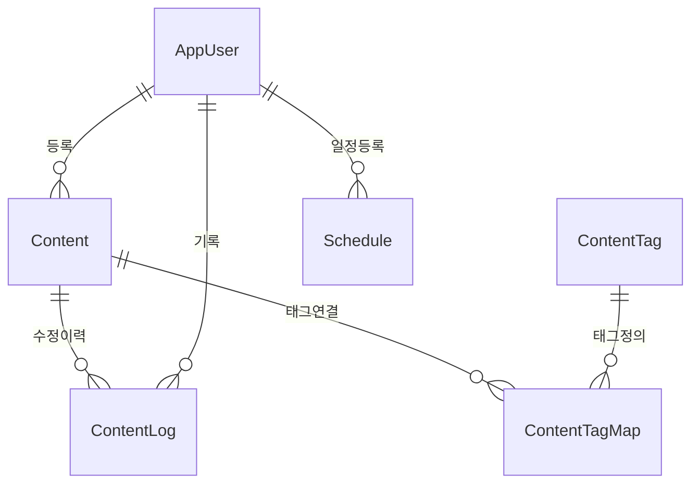
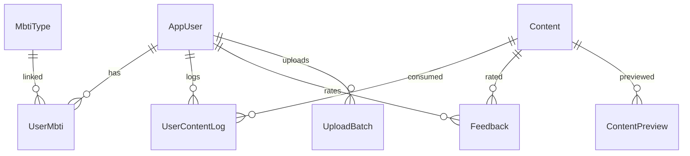
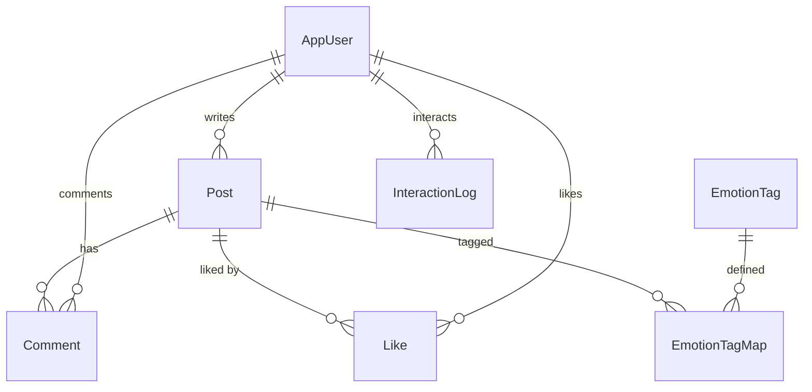
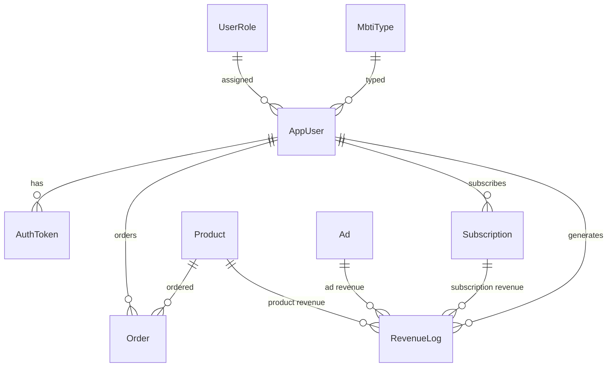
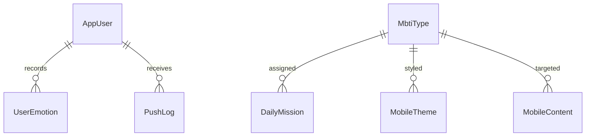

#### ✅ 공통 사용자 모듈 (중앙 인증 서버 기반)



- `AppUser`는 사용자 중심 테이블입니다.
- `MbtiType`은 성향 유형을 연결합니다.
- `UserRole`은 권한을 연결합니다.
- `JwtToken`은 토큰 발급 이력입니다.
- `UserLoginLog`는 로그인 기록입니다.


<br/>
<br/>
<br/>

#### 1. `AppUser`
| 필드명 | 타입 | 설명 |
|--------|------|------|
| app_user_id | INT (PK) | 사용자 고유 ID |
| email | VARCHAR(100) | 이메일 주소 |
| password | VARCHAR(255) | 암호화된 비밀번호 |
| mbti_type_id | INT (FK → MbtiType.mbti_type_id) | 연결된 MBTI 유형 |
| user_role_id | INT (FK → UserRole.user_role_id) | 사용자 역할 |
| created_at | DATETIME | 가입일 |

**예시 데이터**
```sql
(1, 'alice@example.com', 'hashed_pw_123', 3, 2, '2025-10-01 10:00:00')
(2, 'bob@example.com', 'hashed_pw_456', 7, 1, '2025-10-02 14:30:00')
```

<br/>
<br/>

---

#### 2. `MbtiType`
| 필드명 | 타입 | 설명 |
|--------|------|------|
| mbti_type_id | INT (PK) | MBTI 유형 ID |
| name | VARCHAR(10) | 유형 이름 (예: ENFP) |
| description | TEXT | 성향 설명 |

**예시 데이터**
```sql
(3, 'ENFP', '열정적이고 창의적인 성향')
(7, 'INTJ', '논리적이고 전략적인 성향')
```

<br/>
<br/>

---

#### 3. `UserRole`
| 필드명 | 타입 | 설명 |
|--------|------|------|
| user_role_id | INT (PK) | 역할 ID |
| name | VARCHAR(50) | 역할 이름 (예: 관리자, 사용자) |

**예시 데이터**
```sql
(1, '관리자')
(2, '일반 사용자')
```

<br/>
<br/>

---

#### 4. `JwtToken`
| 필드명 | 타입 | 설명 |
|--------|------|------|
| token_id | INT (PK) | 토큰 ID |
| app_user_id | INT (FK → AppUser.app_user_id) | 사용자 ID |
| access_token | TEXT | 액세스 토큰 |
| issued_at | DATETIME | 발급 시간 |
| expires_at | DATETIME | 만료 시간 |

**예시 데이터**
```sql
(1, 1, 'eyJhbGciOiJIUzI1NiIsInR5cCI6IkpXVCJ9...', '2025-10-01 10:00:00', '2025-10-01 12:00:00')
(2, 2, 'eyJhbGciOiJIUzI1NiIsInR5cCI6IkpXVCJ9...', '2025-10-02 14:30:00', '2025-10-02 16:30:00')
```

<br/>
<br/>

---

#### 5. `UserLoginLog`
| 필드명 | 타입 | 설명 |
|--------|------|------|
| log_id | INT (PK) | 로그 ID |
| app_user_id | INT (FK → AppUser.app_user_id) | 사용자 ID |
| login_time | DATETIME | 로그인 시간 |
| ip_address | VARCHAR(50) | 접속 IP 주소 |

**예시 데이터**
```sql
(1, 1, '2025-10-01 10:01:00', '192.168.0.1')
(2, 2, '2025-10-02 14:31:00', '192.168.0.2')
```

<br/>
<br/>

---

## 💡 PROJECT1: MBTI 테스트 + 결과보기



- `Question`은 테스트 질문입니다.
- `Choice`는 보기이며 MBTI 유형과 연결됩니다.
- `QuestionLog`는 사용자 응답 기록입니다.
- `QuestionAudit`은 질문 변경 이력입니다.
- `Tag`는 질문에 연결된 키워드이며 `QuestionTagMap`을 통해 다대다 관계로 연결됩니다.


#### 1. `Question`
| 필드명 | 타입 | 설명 |
|--------|------|------|
| question_id | INT (PK) | 질문 ID |
| text | TEXT | 질문 내용 |
| created_by | INT (FK → AppUser.app_user_id) | 등록자 |
| created_at | DATETIME | 등록일 |

**예시 데이터**
```sql
(101, '당신은 새로운 사람을 만나는 걸 좋아하나요?', 1, '2025-10-10 09:00:00')
(102, '계획 없이 여행을 떠나는 걸 즐기시나요?', 2, '2025-10-11 11:30:00')
```

<br/>
<br/>

---

#### 2. `Choice`
| 필드명 | 타입 | 설명 |
|--------|------|------|
| choice_id | INT (PK) | 보기 ID |
| question_id | INT (FK → Question.question_id) | 연결된 질문 |
| text | VARCHAR(255) | 보기 내용 |
| mbti_type_id | INT (FK → MbtiType.mbti_type_id) | 연결된 MBTI 유형 |

**예시 데이터**
```sql
(201, 101, '예', 3)
(202, 101, '아니오', 7)
```

<br/>
<br/>

---

#### 3. `QuestionLog`
| 필드명 | 타입 | 설명 |
|--------|------|------|
| log_id | INT (PK) | 응답 기록 ID |
| app_user_id | INT (FK → AppUser.app_user_id) | 사용자 |
| question_id | INT (FK → Question.question_id) | 질문 |
| choice_id | INT (FK → Choice.choice_id) | 선택한 보기 |
| timestamp | DATETIME | 응답 시간 |

**예시 데이터**
```sql
(1, 1, 101, 201, '2025-10-12 08:45:00')
(2, 2, 102, 202, '2025-10-12 09:15:00')
```

<br/>
<br/>


---

#### 4. `Tag`
| 필드명 | 타입 | 설명 |
|--------|------|------|
| tag_id | INT (PK) | 태그 ID |
| name | VARCHAR(50) | 태그 이름 |

**예시 데이터**
```sql
(1, '감성')
(2, '자기계발')
```


<br/>
<br/>


---

#### 5. `QuestionTagMap`
| 필드명 | 타입 | 설명 |
|--------|------|------|
| question_id | INT (FK → Question.question_id) | 질문 |
| tag_id | INT (FK → Tag.tag_id) | 태그 |

**예시 데이터**
```sql
(101, 1)
(102, 2)
```

---

#### 6. `QuestionAudit`
| 필드명 | 타입 | 설명 |
|--------|------|------|
| audit_id | INT (PK) | 변경 이력 ID |
| question_id | INT (FK → Question.question_id) | 대상 질문 |
| action_type | VARCHAR(50) | 변경 유형 (등록, 수정, 삭제 등) |
| changed_by | INT (FK → AppUser.app_user_id) | 변경자 |
| changed_at | DATETIME | 변경 시간 |

**예시 데이터**
```sql
(1, 101, '등록', 1, '2025-10-10 09:00:00')
(2, 102, '등록', 2, '2025-10-11 11:30:00')
```

<br/>
<br/>
<br/>
<br/>

 

---

## 💡 PROJECT2: 추천 콘텐츠 등록 및 관리



- `Content`는 추천 콘텐츠 정보입니다.
- `ContentTag`는 콘텐츠에 붙는 태그 정의입니다.
- `ContentTagMap`은 콘텐츠와 태그 간 다대다 관계를 연결합니다.
- `Schedule`은 일정 등록 및 알림 기능을 위한 테이블입니다.
- `ContentLog`는 콘텐츠 등록 및 수정 이력을 기록합니다.
- `AppUser`는 콘텐츠 및 일정의 등록자입니다.

<br/>
<br/>

---

#### 1. `Content`
| 필드명 | 타입 | 설명 |
|--------|------|------|
| content_id | INT (PK) | 콘텐츠 ID |
| title | VARCHAR(100) | 콘텐츠 제목 |
| description | TEXT | 설명 |
| type | VARCHAR(50) | 콘텐츠 유형 (예: 음악, 책) |
| created_by | INT (FK → AppUser.app_user_id) | 등록자 |
| created_at | DATETIME | 등록일 |

**예시 데이터**
```sql
(301, '감성 팝 플레이리스트', 'ENFP에게 추천하는 음악 모음', '음악', 1, '2025-10-15 10:00:00')
(302, '자기계발서 추천', 'INTJ에게 적합한 책 목록', '책', 2, '2025-10-16 14:00:00')
```

<br/>
<br/>

---

#### 2. `ContentTag`
| 필드명 | 타입 | 설명 |
|--------|------|------|
| tag_id | INT (PK) | 태그 ID |
| name | VARCHAR(50) | 태그 이름 |

**예시 데이터**
```sql
(1, '음악')
(2, '자기계발')
```

<br/>
<br/>

---

#### 3. `ContentTagMap`
| 필드명 | 타입 | 설명 |
|--------|------|------|
| content_id | INT (FK → Content.content_id) | 콘텐츠 ID |
| tag_id | INT (FK → ContentTag.tag_id) | 태그 ID |

**예시 데이터**
```sql
(301, 1)
(302, 2)
```

<br/>
<br/>

---

#### 4. `Schedule`
| 필드명 | 타입 | 설명 |
|--------|------|------|
| schedule_id | INT (PK) | 일정 ID |
| title | VARCHAR(100) | 일정 제목 |
| start_time | DATETIME | 시작 시간 |
| end_time | DATETIME | 종료 시간 |
| is_reminder | BOOLEAN | 알림 여부 |
| created_by | INT (FK → AppUser.app_user_id) | 등록자 |

**예시 데이터**
```sql
(401, 'ENFP 콘텐츠 업데이트', '2025-10-20 09:00:00', '2025-10-20 10:00:00', TRUE, 1)
(402, 'INTJ 독서 콘텐츠 등록', '2025-10-21 13:00:00', '2025-10-21 14:00:00', FALSE, 2)
```

<br/>
<br/>

---

#### 5. `ContentLog`
| 필드명 | 타입 | 설명 |
|--------|------|------|
| log_id | INT (PK) | 로그 ID |
| content_id | INT (FK → Content.content_id) | 콘텐츠 ID |
| action_type | VARCHAR(50) | 작업 유형 (등록, 수정 등) |
| changed_by | INT (FK → AppUser.app_user_id) | 작업자 |
| changed_at | DATETIME | 작업 시간 |

**예시 데이터**
```sql
(501, 301, '등록', 1, '2025-10-15 10:00:00')
(502, 302, '등록', 2, '2025-10-16 14:00:00')
```

<br/>
<br/>
<br/>
<br/>
 

 

---

## 💡 PROJECT3: MBTI 성향 기반 콘텐츠 추천 웹앱



- `UserMbti`는 사용자와 MBTI 유형을 연결합니다.
- `UserContentLog`는 사용자가 소비한 콘텐츠 기록입니다.
- `Feedback`은 콘텐츠에 대한 사용자 평가입니다.
- `ContentPreview`는 콘텐츠 미리보기 정보입니다.
- `UploadBatch`는 CSV 업로드 이력 및 오류 기록입니다.

<br/>
<br/>

---

#### 1. `UserMbti`
| 필드명 | 타입 | 설명 |
|--------|------|------|
| user_mbti_id | INT (PK) | 연결 ID |
| app_user_id | INT (FK → AppUser.app_user_id) | 사용자 |
| mbti_type_id | INT (FK → MbtiType.mbti_type_id) | MBTI 유형 |
| assigned_at | DATETIME | 연결 시점 |

**예시 데이터**
```sql
(1, 1, 3, '2025-10-01 10:00:00')
(2, 2, 7, '2025-10-02 14:30:00')
```

<br/>
<br/>

---

#### 2. `Content`
| 필드명 | 타입 | 설명 |
|--------|------|------|
| content_id | INT (PK) | 콘텐츠 ID |
| title | VARCHAR(100) | 콘텐츠 제목 |
| description | TEXT | 설명 |
| type | VARCHAR(50) | 콘텐츠 유형 |
| created_at | DATETIME | 등록일 |

**예시 데이터**
```sql
(301, '감성 팝 플레이리스트', 'ENFP에게 추천하는 음악 모음', '음악', '2025-10-15 10:00:00')
(302, '자기계발서 추천', 'INTJ에게 적합한 책 목록', '책', '2025-10-16 14:00:00')
```

<br/>
<br/>

---

#### 3. `UserContentLog`
| 필드명 | 타입 | 설명 |
|--------|------|------|
| log_id | INT (PK) | 로그 ID |
| app_user_id | INT (FK → AppUser.app_user_id) | 사용자 |
| content_id | INT (FK → Content.content_id) | 콘텐츠 |
| action_type | VARCHAR(50) | 행동 유형 (조회, 좋아요 등) |
| timestamp | DATETIME | 시간 |

**예시 데이터**
```sql
(501, 1, 301, '조회', '2025-10-22 10:30:00')
(502, 2, 302, '좋아요', '2025-10-22 11:00:00')
```

<br/>
<br/>

---

#### 4. `Feedback`
| 필드명 | 타입 | 설명 |
|--------|------|------|
| feedback_id | INT (PK) | 피드백 ID |
| app_user_id | INT (FK → AppUser.app_user_id) | 사용자 |
| content_id | INT (FK → Content.content_id) | 콘텐츠 |
| rating | INT | 만족도 (1~5) |
| comment | TEXT | 코멘트 |

**예시 데이터**
```sql
(601, 1, 301, 5, '정말 내 취향이에요!')
(602, 2, 302, 3, '괜찮지만 조금 지루했어요.')
```

<br/>
<br/>

---

#### 5. `ContentPreview`
| 필드명 | 타입 | 설명 |
|--------|------|------|
| preview_id | INT (PK) | 미리보기 ID |
| content_id | INT (FK → Content.content_id) | 콘텐츠 |
| mbti_type_id | INT (FK → MbtiType.mbti_type_id) | 대상 MBTI 유형 |
| preview_text | TEXT | 미리보기 설명 |

**예시 데이터**
```sql
(701, 301, 3, 'ENFP를 위한 감성 음악 미리보기')
(702, 302, 7, 'INTJ를 위한 자기계발 콘텐츠 요약')
```

<br/>
<br/>

---

#### 6. `UploadBatch`
| 필드명 | 타입 | 설명 |
|--------|------|------|
| batch_id | INT (PK) | 업로드 ID |
| app_user_id | INT (FK → AppUser.app_user_id) | 업로드한 사용자 |
| file_name | VARCHAR(100) | 파일 이름 |
| status | VARCHAR(50) | 처리 상태 (성공, 오류 등) |
| uploaded_at | DATETIME | 업로드 시간 |

**예시 데이터**
```sql
(801, 1, 'questions.csv', '성공', '2025-10-23 09:00:00')
(802, 2, 'contents.csv', '오류', '2025-10-23 09:30:00')
```

<br/>
<br/>
<br/>
<br/>
 

 

---

## 💡 PROJECT4: MBTI 커뮤니티 + 취향 공유 플랫폼



- `Post`는 커뮤니티 게시글입니다.
- `Comment`는 게시글에 대한 댓글입니다.
- `Like`는 게시글 좋아요 정보입니다.
- `EmotionTag`는 게시글에 연결된 감정 태그입니다.
- `EmotionTagMap`은 게시글과 감정 태그 간 다대다 관계를 연결합니다.
- `InteractionLog`는 사용자 간 상호작용 기록입니다.

<br/>
<br/>

---

#### 1. `Post`
| 필드명 | 타입 | 설명 |
|--------|------|------|
| post_id | INT (PK) | 게시글 ID |
| app_user_id | INT (FK → AppUser.app_user_id) | 작성자 |
| content | TEXT | 게시글 내용 |
| created_at | DATETIME | 작성 시간 |

**예시 데이터**
```sql
(701, 1, '오늘은 감성적인 음악이 듣고 싶어요.', '2025-10-25 09:00:00')
(702, 2, 'INTJ에게 추천할 만한 책 있나요?', '2025-10-25 10:15:00')
```

<br/>
<br/>

---

#### 2. `Comment`
| 필드명 | 타입 | 설명 |
|--------|------|------|
| comment_id | INT (PK) | 댓글 ID |
| post_id | INT (FK → Post.post_id) | 대상 게시글 |
| app_user_id | INT (FK → AppUser.app_user_id) | 작성자 |
| content | TEXT | 댓글 내용 |
| created_at | DATETIME | 작성 시간 |

**예시 데이터**
```sql
(801, 701, 2, 'ENFP라면 이 노래 추천해요!', '2025-10-25 09:30:00')
(802, 702, 1, 'INTJ라면 <생각의 기술> 좋아요.', '2025-10-25 10:45:00')
```

<br/>
<br/>

---

#### 3. `Like`
| 필드명 | 타입 | 설명 |
|--------|------|------|
| post_id | INT (FK → Post.post_id) | 게시글 |
| app_user_id | INT (FK → AppUser.app_user_id) | 좋아요 누른 사용자 |

**예시 데이터**
```sql
(701, 2)
(702, 1)
```

<br/>
<br/>

---

#### 4. `EmotionTag`
| 필드명 | 타입 | 설명 |
|--------|------|------|
| tag_id | INT (PK) | 감정 태그 ID |
| name | VARCHAR(50) | 감정 이름 |

**예시 데이터**
```sql
(1, '기쁨')
(2, '불안')
```

<br/>
<br/>

---

#### 5. `EmotionTagMap`
| 필드명 | 타입 | 설명 |
|--------|------|------|
| post_id | INT (FK → Post.post_id) | 게시글 |
| tag_id | INT (FK → EmotionTag.tag_id) | 감정 태그 |

**예시 데이터**
```sql
(701, 1)
(702, 2)
```

<br/>
<br/>

---

#### 6. `InteractionLog`
| 필드명 | 타입 | 설명 |
|--------|------|------|
| log_id | INT (PK) | 상호작용 ID |
| from_user_id | INT (FK → AppUser.app_user_id) | 반응한 사용자 |
| to_user_id | INT (FK → AppUser.app_user_id) | 대상 사용자 |
| post_id | INT (FK → Post.post_id) | 대상 게시글 |
| reaction_type | VARCHAR(50) | 반응 유형 (댓글, 좋아요 등) |
| timestamp | DATETIME | 반응 시간 |

**예시 데이터**
```sql
(1, 1, 2, 702, '댓글', '2025-10-25 10:45:00')
(2, 2, 1, 701, '좋아요', '2025-10-25 09:30:00')
```

<br/>
<br/>
<br/>
<br/>


 
---

## 💡 PROJECT5: MBTI 기반 라이프스타일 통합 앱 + 수익형



- `AppUser`는 사용자 정보이며 인증, 구매, 구독, 수익과 연결됩니다.
- `AuthToken`은 JWT 인증 토큰입니다.
- `Order`는 상품 구매 내역입니다.
- `Subscription`은 콘텐츠 구독 정보입니다.
- `RevenueLog`는 수익 기록입니다.
- `Ad`, `Product`, `Subscription`은 각각 수익의 출처로 연결됩니다.

<br/>
<br/>

---

#### 1. `AuthToken`
| 필드명 | 타입 | 설명 |
|--------|------|------|
| token_id | INT (PK) | 토큰 ID |
| app_user_id | INT (FK → AppUser.app_user_id) | 사용자 |
| access_token | TEXT | 액세스 토큰 |
| issued_at | DATETIME | 발급 시간 |
| expires_at | DATETIME | 만료 시간 |

**예시 데이터**
```sql
(1, 1, 'eyJhbGciOiJIUzI1NiIsInR5cCI6IkpXVCJ9...', '2025-10-01 10:00:00', '2025-10-01 12:00:00')
(2, 2, 'eyJhbGciOiJIUzI1NiIsInR5cCI6IkpXVCJ9...', '2025-10-02 14:30:00', '2025-10-02 16:30:00')
```

<br/>
<br/>

---

#### 2. `Ad`
| 필드명 | 타입 | 설명 |
|--------|------|------|
| ad_id | INT (PK) | 광고 ID |
| title | VARCHAR(100) | 광고 제목 |
| target_mbti | VARCHAR(10) | 타겟 MBTI 유형 |
| click_rate | DECIMAL(5,2) | 클릭률 |

**예시 데이터**
```sql
(901, 'ENFP를 위한 감성 굿즈', 'ENFP', 0.12)
(902, 'INTJ를 위한 생산성 앱', 'INTJ', 0.08)
```

<br/>
<br/>

---

#### 3. `Product`
| 필드명 | 타입 | 설명 |
|--------|------|------|
| product_id | INT (PK) | 상품 ID |
| name | VARCHAR(100) | 상품 이름 |
| price | INT | 가격 |
| category | VARCHAR(50) | 카테고리 |

**예시 데이터**
```sql
(1001, 'ENFP 감성 노트', 12000, '문구')
(1002, 'INTJ 집중 타이머', 18000, '디지털')
```

<br/>
<br/>

---

#### 4. `Order`
| 필드명 | 타입 | 설명 |
|--------|------|------|
| order_id | INT (PK) | 주문 ID |
| app_user_id | INT (FK → AppUser.app_user_id) | 사용자 |
| product_id | INT (FK → Product.product_id) | 상품 |
| quantity | INT | 수량 |
| order_date | DATE | 주문일 |

**예시 데이터**
```sql
(1101, 1, 1001, 2, '2025-10-26')
(1102, 2, 1002, 1, '2025-10-26')
```

<br/>
<br/>

---

#### 5. `Subscription`
| 필드명 | 타입 | 설명 |
|--------|------|------|
| subscription_id | INT (PK) | 구독 ID |
| app_user_id | INT (FK → AppUser.app_user_id) | 사용자 |
| plan_name | VARCHAR(100) | 구독 이름 |
| start_date | DATE | 시작일 |
| end_date | DATE | 종료일 |

**예시 데이터**
```sql
(1201, 1, 'ENFP 콘텐츠 구독', '2025-10-01', '2025-12-31')
(1202, 2, 'INTJ 콘텐츠 구독', '2025-10-01', '2025-12-31')
```

<br/>
<br/>

---

#### 6. `RevenueLog`
| 필드명 | 타입 | 설명 |
|--------|------|------|
| log_id | INT (PK) | 수익 로그 ID |
| source_type | VARCHAR(50) | 수익 출처 (상품, 구독, 광고 등) |
| source_id | INT | 출처 ID (product_id, subscription_id, ad_id 등) |
| amount | INT | 수익 금액 |
| timestamp | DATETIME | 수익 발생 시간 |

**예시 데이터**
```sql
(1301, '상품', 1001, 24000, '2025-10-26 12:00:00')
(1302, '구독', 1202, 9900, '2025-10-26 12:30:00')
```

<br/>
<br/>
<br/>
<br/>  
 

---

## 💡 PROJECT6: 모바일 UX 최적화 앱



- `UserEmotion`은 사용자의 감정 기록입니다.
- `DailyMission`은 MBTI 유형별 데일리 미션입니다.
- `MobileTheme`은 MBTI 유형별 테마 설정입니다.
- `PushLog`는 푸시 알림 기록입니다.
- `MobileContent`는 모바일 전용 콘텐츠입니다.

<br/>
<br/>

---

#### 1. `UserEmotion`
| 필드명 | 타입 | 설명 |
|--------|------|------|
| emotion_id | INT (PK) | 감정 기록 ID |
| app_user_id | INT (FK → AppUser.app_user_id) | 사용자 |
| emotion_tag | VARCHAR(50) | 감정 태그 (예: 기쁨, 불안) |
| memo | TEXT | 감정 메모 |
| recorded_at | DATETIME | 기록 시간 |

**예시 데이터**
```sql
(1401, 1, '기쁨', '좋은 음악을 들었다.', '2025-10-26 08:00:00')
(1402, 2, '불안', '일이 많아서 스트레스 받음.', '2025-10-26 09:00:00')
```

<br/>
<br/>

---

#### 2. `DailyMission`
| 필드명 | 타입 | 설명 |
|--------|------|------|
| mission_id | INT (PK) | 미션 ID |
| mbti_type_id | INT (FK → MbtiType.mbti_type_id) | 대상 MBTI 유형 |
| title | VARCHAR(100) | 미션 제목 |
| description | TEXT | 미션 설명 |

**예시 데이터**
```sql
(1501, 3, 'ENFP 미션', '새로운 사람에게 인사하기')
(1502, 7, 'INTJ 미션', '하루 계획 세우기')
```

<br/>
<br/>

---

#### 3. `MobileTheme`
| 필드명 | 타입 | 설명 |
|--------|------|------|
| theme_id | INT (PK) | 테마 ID |
| mbti_type_id | INT (FK → MbtiType.mbti_type_id) | 대상 MBTI 유형 |
| color_scheme | VARCHAR(50) | 색상 테마 (예: pastel, dark) |
| font_style | VARCHAR(50) | 폰트 스타일 (예: rounded, minimal) |

**예시 데이터**
```sql
(1601, 3, 'pastel', 'rounded')
(1602, 7, 'dark', 'minimal')
```

<br/>
<br/>

---

#### 4. `PushLog`
| 필드명 | 타입 | 설명 |
|--------|------|------|
| push_id | INT (PK) | 푸시 알림 ID |
| app_user_id | INT (FK → AppUser.app_user_id) | 사용자 |
| message | TEXT | 알림 메시지 |
| sent_at | DATETIME | 발송 시간 |

**예시 데이터**
```sql
(1701, 1, '오늘의 추천 콘텐츠가 도착했어요!', '2025-10-26 08:30:00')
(1702, 2, '오늘의 미션을 확인하세요.', '2025-10-26 09:30:00')
```

<br/>
<br/>

---

#### 5. `MobileContent`
| 필드명 | 타입 | 설명 |
|--------|------|------|
| content_id | INT (PK) | 콘텐츠 ID |
| title | VARCHAR(100) | 콘텐츠 제목 |
| preview_text | TEXT | 미리보기 설명 |
| mbti_type_id | INT (FK → MbtiType.mbti_type_id) | 대상 MBTI 유형 |

**예시 데이터**
```sql
(1801, 'ENFP를 위한 감성 영상', '오늘 하루를 따뜻하게 시작해보세요.', 3)
(1802, 'INTJ를 위한 집중 팁', '생산성을 높이는 3가지 방법.', 7)
```

<br/>
<br/>
<br/>
<br/>
 