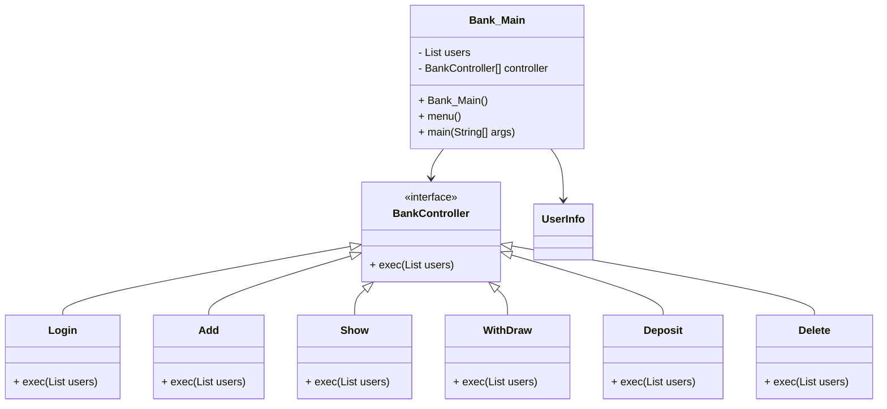

```mermaid
classDiagram
    class Bank_Main {
        - List<UserInfo> users
        - BankController[] controller
        + Bank_Main()
        + menu()
        + main(String[] args)
    }

    class BankController {
        <<interface>>
        + exec(List<UserInfo> users)
    }

    class Login {
        + exec(List<UserInfo> users)
    }
    class Add {
        + exec(List<UserInfo> users)
    }
    class Show {
        + exec(List<UserInfo> users)
    }
    class WithDraw {
        + exec(List<UserInfo> users)
    }
    class Deposit {
        + exec(List<UserInfo> users)
    }
    class Delete {
        + exec(List<UserInfo> users)
    }

    Bank_Main --> UserInfo
    Bank_Main --> BankController
    BankController <|-- Login
    BankController <|-- Add
    BankController <|-- Show
    BankController <|-- WithDraw
    BankController <|-- Deposit
    BankController <|-- Delete

```