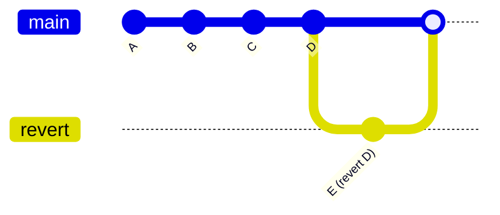
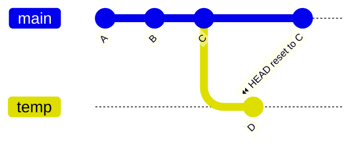

##### ■1. 깃BASIC 
```
#1. 가방에 담기  ( 불꽃마법재료, 불씨,,,)
git  add .

#2. 가방에 메시지남기기 (불꽃마법 완성)
git commit -m "메시지"

#3. [공용-github - 마법책] 같은 마법책을 쓰니깐 서로 바뀐거 확인
git pull origin master

#4. [공용-github - 마법책] 에 불꽃마법 올리기 (공유)
git push origin master

```

##### ■2. 깃협업
1. 팀원초대
2. 협업 중 같은 파일ㅇ르 수정하면서 생기는 충돌(conflict) 해결

```
#1. 팀장 - 팀원초대 (github 웹)
#2. 팀원 - repository 클론
  git clone 깃허브주소

#3. 팀원 - branch
  git checkout -b branch명
#4. 팀원 - 파일작성
 git add .
 git commit -m "message"
 git pull   origin  master 
 git push   origin  master

 ※ 충돌 - HEAD , ====== , >>>>>> / 코드수정

#5. 팀원 - pr 
```

> **Question**
```
Q1. 팀장 - test2.md 파일만들기 > 안녕하세요 포젝트입니다.
Q2. 팀원 - test2.md          > 안녕하세요 팀원 **입니다.
      충돌시- 충돌해결 후 코드 
      안녕하세요 포젝트입니다.
      팀장 : 세상에서 젤로 멋찐 홍길동입니다.
      팀원 : 세상에서 젤로 귀여운 가길동입니다.
```


##### ■3. merge  vs  rebase
1. 기능 브랜치에서 작업 중  main브랜치가 업데이트가 된 경우
> 여러 마법사가 함께 주문서를 쓰고있을때 
- 내가 주문을 다시쓰면 친구들의 주문이 사라 질수 있음.

★  브랜치 꼭확인!
```
#1. 불꽃마법사가 본인코드 작성중  (dev-f)
   git add spell2.md
   git commit -m "불꽃마법2 추가"

#2. 메인 마법서가 업데이트가 됨.
    불꽃마법사가 최신 마법서 위에 자신의 주문을 다시 써야 함.

    git checkout master
    git pull origin master

    # 최신 마법서 위에 주문 다시 쓰기 
    git checkout dev-f
    git rebase master   
    # > master 브랜치기준으로 내작업을 다시 정렬
    # > 주문이 겹쳐서 마법서 충돌남. 어떤 주문 쓸지 선택 / 수정완료

    git add  spell2.md
    git rebase  --continue

    # 안전하게 주문서 공유
    git push  --force-with-lease
```

> **Question1**
```
1.  test2.md 파일에 테이블옆에 본인이모지  🔥 붙이기
2.  rebase 해서 파일 다시 올리기
```

> **Question2**
```
1.  팀장님      - test2.md  ( 깃허브에서 응원의 메시지 남겨주기)
2.  팀원        - test2.md 파일에 본인이 다른친구들한테 또는 본인한테 남기는 응원의 메시지적기 
3.  팀장 + 팀원  - rebase 해서 파일 다시 올리기
```


##### ■4. fetch  vs  pull
- fetch : 데이터 가져오기 ( 충돌이 날지 먼저 확인 ) 
- pull  : 데이터 가져오고 바로 합치기 (위험의 가능성)

```bash
#1. [ github ]  test.md  - 새로운 사항 업데이트
#2. [local] 작업 - 새로운 변경사항있는지 확인
   git fetch  origin
#3. 가져온 변경사항 확인
   git log     a1dc3bc..36ff096
   git log     HEAD..orgin/master
   git diff    HEAD  origin/master  -- 변경된 내용파일
   git diff -- HEAD  origin/master 
#4. 확인후 합치기 
   git merge orgin/master   

Q1.  git pull 이 아니라 get fetch 데이터 가져오기  
1-1. 팀장 - [깃허브] test2.md  
    ★ 자격증 공부
    - day001 이론완료 : 이름붙여주기
1-2. 팀원 - [깃허브] test2.md 수정 
    -  git pull 이 아니라 get fetch 데이터 가져오기  
```


##### ■5.  restore   
- restore  : 파일을 예전 상태로 되돌리는 기능  (최근상태로 되돌리기) , commit 안했을때사용가능
- checkout : 브랜치 바꾸거나 파일 되돌리기

``` bash
git restore  파일명   # 마지막으로 저장한상태로 돌아감.
git restore   --source=HEAD~1  파일명   # HEAD~1  1단계  , HEAD~2  2단계  커밋상태로 돌아감.
```


##### ■6. revert vs reset

🧙‍♂️ 마법사 Bob의 실수
---
🪄 두 가지 되돌리기 마법
| 마법 주문 | 하는 일 | 안전한가요? | 언제 쓰나요? |
|-----------|---------|-------------|--------------|
| revert | 잘못된 주문을 취소하는 새 주문을 써요 | 🛡️ 안전해요 | 모두가 함께 쓰는 마법서에서 |
| reset | 잘못된 주문을 아예 지워버려요 | ⚠️ 위험할 수 있어요 | 나 혼자 쓰는 마법서에서 |

실습)
🧪 마법 실습 단계별 안내서
🧙‍♀️ 1단계: 공유 마법서에서 되돌리기 (revert 사용)
> Bob은 실수한 주문을 취소하는 새 주문을 써요.  
> 마법서 히스토리는 그대로 남고, 친구들에게 피해도 없어요!

#### (1) 실습  revert

##### 🧵 전체 흐름 요약

1. **test 브랜치 생성 및 작업**
   ```bash
   git checkout -b "test"
   파일작성 test.md
   git add .
   git commit -m "test"
   git push origin test
   ```
   → `test` 브랜치에서 새로운 작업을 하고 원격 저장소에 푸시함.

2. **main 브랜치에 병합**
   ```bash
   git checkout main
   git pull origin main
   git merge test
   git push origin main
   ```
   → `test` 브랜치의 작업을 `main` 브랜치에 병합하고 푸시함.
   → 이 시점에서 `main` 브랜치에 변경 사항이 반영됨.

3. **main 브랜치에서 되돌리기**
   ```bash
   git log
   git revert <commit_hash>
   git push origin main
   ```
   → `main` 브랜치에서 병합된 커밋을 되돌리는 작업.
   → `revert`는 병합 커밋도 되돌릴 수 있지만, 병합 커밋을 되돌릴 땐 `-m` 옵션을 써야 해요 (어느 부모를 기준으로 되돌릴지 명시해야 함).

---

🧙‍♂️ 2단계: 개인 마법서에서 되돌리기 (reset 사용)

- `main`: 공유 마법서 (모두가 보는 브랜치)
- `test`: Bob이 실험하는 개인 마법서

#### (2) 실습  reset

##### 🧵 전체 흐름 요약

1. **Bob이 `test` 브랜치에서 실험을 시작**
```bash
git checkout -b test
파일작성 test.md
git add .
git commit -m "실험 커밋"
git push origin test
```
→ Bob은 `test` 브랜치에서 실험 커밋을 만들고 원격에 올림.

2. **Bob이 실험 결과를 `main`에 병합**
```bash
git checkout main
git pull origin main
git merge test
git push origin main
```
→ `test` 브랜치의 내용을 `main`에 병합해서 모두가 보는 마법서에 반영함.

3. **그런데 실험이 잘못됐다는 걸 깨달음! 😱**  
→ Bob은 `main` 브랜치에서 병합 커밋을 되돌리기로 결심.

4. **병합 커밋을 아예 없던 일로 만들기 (히스토리 되돌리기)**
```bash
git log  # 병합 이전 커밋 확인
git reset --hard HEAD~1  # 병합 커밋 이전으로 HEAD 이동
```
→ 병합 커밋을 아예 삭제하고, 이전 상태로 되돌림.

5. **원격 저장소에도 강제로 반영**
```bash
git push --force-with-lease
```
→ 원격 `main` 브랜치도 덮어쓰기.  
⚠️ 이건 위험한 마법! 다른 마법사가 작업 중이었다면 커밋이 사라질 수 있어요.
 
 
---

🔄 마법서 히스토리 비교 - 추천
revert 사용 시 (공용마법서)



reset 사용 시 (개인마법서)


 