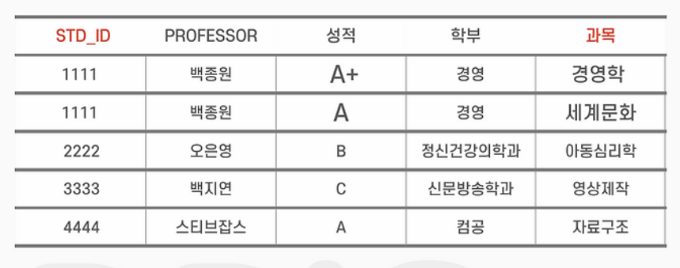

 

###### 🛠 1. ERD

- **ERD**
- **ENTITY** (테이블)
- **RELATIONSHIP** (관계)
- **ATTRIBUTE** (속성)  
  예) `EMP(deptno:부서번호, FK)` – `DEPT(deptno:부서번호, PK)`  
  > 데이터 간에 **관계**에 초점을 둔 모델

##### 참고: [ERD 설명 블로그](https://hi-sally03915.tistory.com/1669)

<br/><br/><br/>

---

###### 🛠 2. 정규화? (NF: Normal Form)

1. 이상을 제거하는 것  
2. 이상: 공간 낭비, 삽입/갱신/삭제 이상  
3. 1NF ~ 5NF

<br/><br/><br/>

---

###### 🛠 3. 1NF (원자값)

- **원자값**: 더 이상 쪼갤 수 없는 단위  
- 각 속성은 하나의 값만

**예시 BEFORE**

| STD_ID | SNAME | GRADE     |
|--------|-------|-----------|
| 1111   | SALLY | A+, A     |

**예시 AFTER**

| STD_ID | SNAME | GRADE |
|--------|-------|-------|
| 1111   | SALLY | A+    |
| 1111   | SALLY | A     |

<br/><br/><br/>

---

###### 🛠 4. 2NF (부분함수 종속 제거)

1. **종속 관계**: X(결정자) → Y(종속자)  
   > 모든 속성이 기본키에 완전 함수 종속되면 제2 정규형  
   > 종속자가 기본키에만 종속

**예시**



**결정자 → 종속자 예시**

- 1-1. `<학번, 수강과목>` → 성적  
- 1-2. `{학번}` → 학부  
- 1-3. `{학번}` → 교수  
- 1-4. `{교수}` → 학부

**부분함수 종속 설명**

- 기본키가 복합키(학번, 수강과목)  
- 종속자가 기본키의 일부 속성에만 종속된 경우

<br/><br/><br/>

---

###### 🛠 5. 3NF (이행함수 종속 제거)

```
1. X → Y → Z
2. 다른 후보키에 의존하지 않음!
3. 테스트 시 insert, update, delete 이상 확인
```

**예시**

- `<학번(PK)>` → `<지도교수(후보키)>` → `<학부>`  
- `[학번(PK), 지도교수]`, `[지도교수(PK), 학부]`

**KEY 개념**

1. **KEY**: 튜플(행)을 구분할 수 있는 기준 필드  
2. **종류**:
   - 후보키: 기본키로 사용할 수 있는 속성 (주민증, 학생증 등)  
     → 유일성 + 최소성  
   - 기본키: 선택된 주키 (중복 X, NULL X)  
   - 대체키: 선택되지 않은 후보키  
   - 슈퍼키: 속성 + 속성으로 구성된 키 (유일성 O, 최소성 X)  
   - 외래키: 테이블 간 연결 속성

<br/><br/><br/>

---

###### 🛠 6. BCNF (Boyce-Codd Normal Form)

- 모든 결정자는 **후보키**  
- 후보키: 기본키로 사용할 수 있는 속성

<br/><br/><br/>

---

###### 🛠 7. 4NF (다치 종속 제거)

- 프로그래밍 과목에  
  - 담당 교수 2명  
  - 교재 코드 2개

**BEFORE**

- `<과목, 교수코드, 교재코드>`  
  → 2×2 = 4  
  → 2×3 = 6

**AFTER**

- `<과목, 교수코드>` → 2  
- `<과목, 교재코드>` → 2

<br/><br/><br/>

---

###### 🛠 8. 5NF (조인 종속 제거)

- 하나의 테이블을 여러 개로 분해 후 다시 조인했을 때  
  → 데이터 손실은 없지만, 필요 없는 데이터가 생김

**예시**

- 다:다 관계 → 중간 테이블 생성  
- 교수는 여러 교재를 갖고  
- 교재는 여러 교수가 사용 가능

**BEFORE**

`<교수> ∋----------------------∈ <교재>`

**AFTER**

`<교수> +---- ∈ <교수교재> ∋-----+ <교재>`

<br/><br/><br/>

---

###### 🛠 9. ERD 작성 단계

1. **SQL Developer 실행 및 로그인**  
   - Oracle DB에 연결된 SQL Developer 실행

2. **Data Modeler 열기**  
   - `파일(File) → 데이터 모델러(Data Modeler) → 가져오기(Import) → 데이터 사전(Data Dictionary)`

3. **DB 연결 설정**  
   - 연결할 데이터베이스 선택 또는 새 연결 생성

4. **스키마 및 객체 선택**  
   - 원하는 **스키마 이름** 체크  
   - **테이블, 뷰, 관계 등 객체** 선택

5. **가져오기 완료**  
   - `다음(Next)` → `Finish` 클릭 → ERD 자동 생성

6. **ERD 편집 및 저장**  
   - 테이블 위치 조정, 관계선 편집 가능  
   - `파일 → 데이터 모델러 → 다이어그램 인쇄`  
     → 이미지 또는 PDF로 저장 가능
 